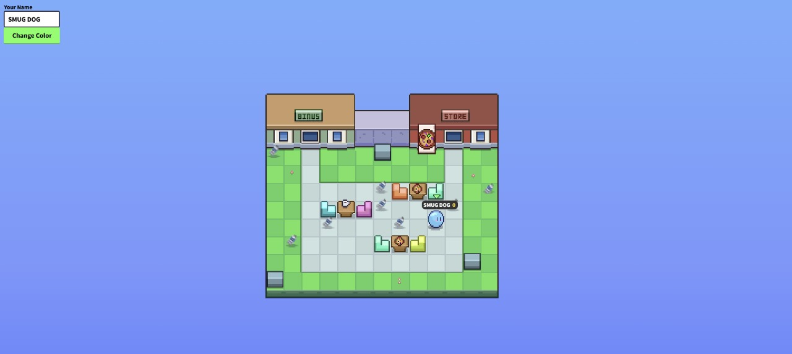

# ♻️ TrashPac - A Multiplayer Trash Collection Game

TrashPac is a **multiplayer** game built with **vanilla JavaScript** where players compete to collect trash.  
The game is powered by **Firebase Realtime Database**, keeping track of player scores and trash collected in real-time.

🌍 **The Goal**: Encourage players to develop a habit of cleaning up their surroundings by making trash collection fun and competitive!

## 🚀 Features

- 🏆 **Multiplayer Mode** – Compete with other players in real time!
- 🌎 **Firebase Integration** – Live updates on the trash collected by all players.
- 🗑️ **Various Trash Types** – Collect different types of trash with varying point values.
- 🎮 **Simple Controls** – Move around with **WASD / Arrow Keys** and collect trash.
- 🎨 **Customizable Avatars** – Stand out with different player skins.

## 📸 Screenshots




## 🛠️ Installation

### 1️⃣ Clone the Repository

```sh
git clone https://github.com/YOUR-USERNAME/TrashPac.git
cd TrashPac
```

### Will be hosted with Vercel Soon!
